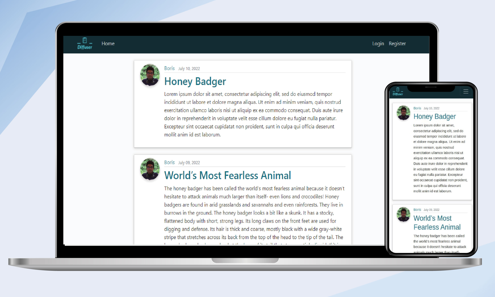

<h2 align="center">
  Diffuser 
  <a href="https://diffuser.borisedison.in/" target="_blank">diffuser.borisedison.in</a>
</h2>
<h4 align="center">A website to blog, made using Django</h4>

  

## Built With

## Features 

- Responsive Blogging Website Using HTML CSS & Bootstrap
- Robust Backend powered by Django
- Compatible with all mobile devices and with a beautiful and pleasant user interface

## Contribute  
Contributions are welcome, and they are greatly appreciated! Every little bit helps, and credit will always be given.

### Not sure where to start?  

##### Step 1:

Download or clone this repository by using the command given below:

`
git clone https://github.com/BorisEdison/Diffuser.git
`

##### Step 2:

Install Virtual Environment:

- Windows  
`pip install --user virtualenv`

- Mac  
`sudo pip3 install virtualenv`

##### Step 3:
Setup Virtual Environment:

- Windows  
`python -m virtualenv env`

- Mac  
`virtualenv -p python env`

##### Step 4:
Activate Virtual Environment:

- Windows  
`env\scripts\activate`

- Mac  
`source env/bin/activate`

##### Step 5:

Install Requirements Packages:

`pip install -r requirements.txt`

##### Step 6:

Run Django Server:

`python manage.py runserver`

### Deployment  

How To Deploy Django App with Nginx, Gunicorn, PostgreSQL and Let’s Encrypt SSL on Ubuntu - [Link](https://www.digitalocean.com/community/tutorials/how-to-set-up-django-with-postgres-nginx-and-gunicorn-on-ubuntu-16-04)

### Show your support

Give a ⭐ if you like this project and feel free to make pull requests

## Contributors 
  - Boris Edison  
  

## License  

Code release under the
[MIT](https://github.com/BorisEdison/Diffuser/blob/main/LICENSE.txt) license
